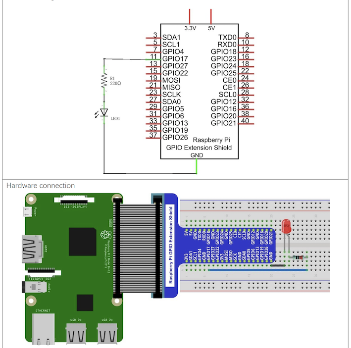
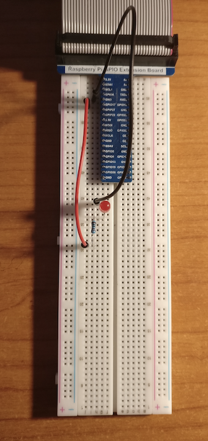

# LED

## Introduction

This project blinks a led.
The led is lighted fro 10 seconds and blank for 5, continouslly.
A second version of the code uses 3 leds to create a semaphore.

## Material

* LED
* Resistor 220 &Omega;

## Circuit

## Code

Code is avialabe in Python.

* ``led_acende_apaga.py``
* ``led\_semaforo.py``

It uses library ``RPi.GPIO``.
GPIO board is used in OUTPUT mode, connected to a port.
Method ``output`` allows to change signal from port.