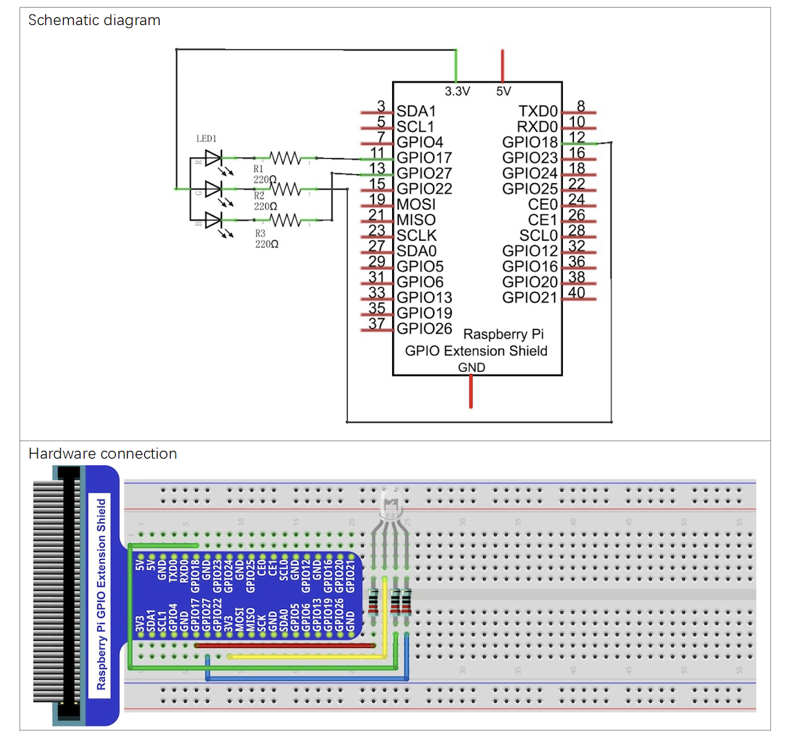
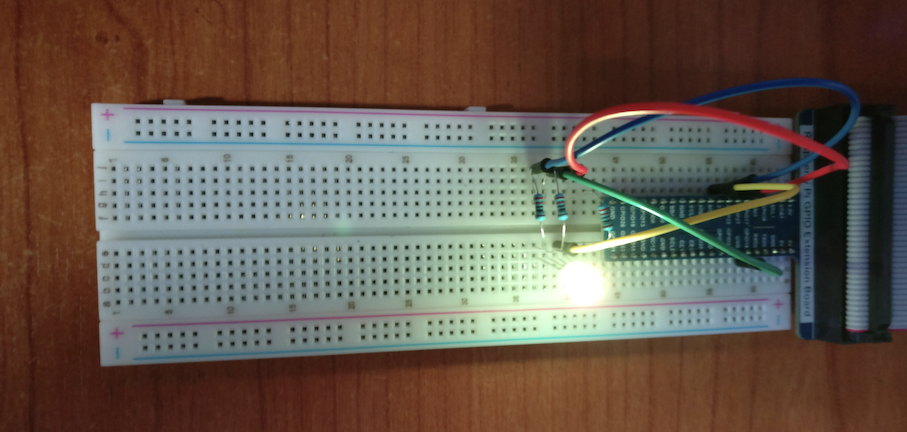

# LED

## Introduction

This project lights a RGB led.
Thed led is lighted with a random color during 5 seconds, after that, the color is changed. 

## Material

* RGB LED
* 3 x Resistor 220 &Omega;

## Circuit

## Code

Code is avialabe in Python.

* ``led_rgb.py``

It uses library ``RPi.GPIO``.

GPIO board is used in OUTPUT mode, with 3 ports per color device.
The ports are set to a specific frequency.
Color control is made with method ''ChangeDutyCycle'' which receveis a value in range [0-100].