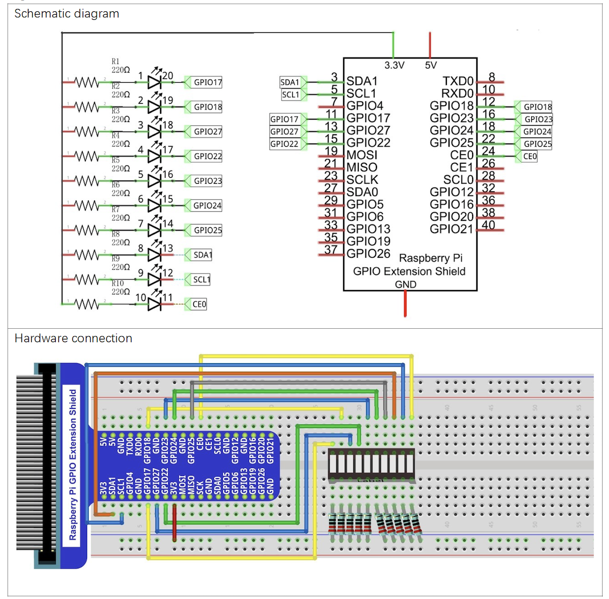
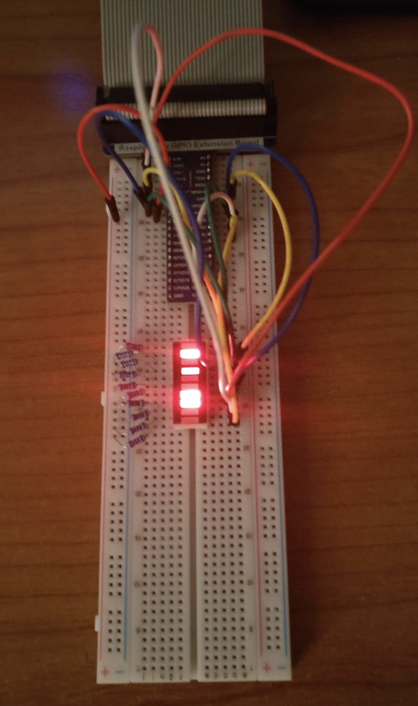

# LED

## Introduction

This project lights a Led bar graph.
Thed led is lighted with a random color during 5 seconds, after that, the color is changed. 
A second version of the code, sets ans resets a position randomly.

## Material

* LED Bar
* 10 x Resistor 220 &Omega;

## Circuit

## Code

Code is avialabe in Python.

* ``led_bar.py``
* ``led_bar_random.py``

It uses library ``RPi.GPIO``.

GPIO board is used in OUTPUT mode, with 3 ports per color device.
The ports are set to a specific frequency.
Color control is made with method ''ChangeDutyCycle'' which receveis a value in range [0-100].