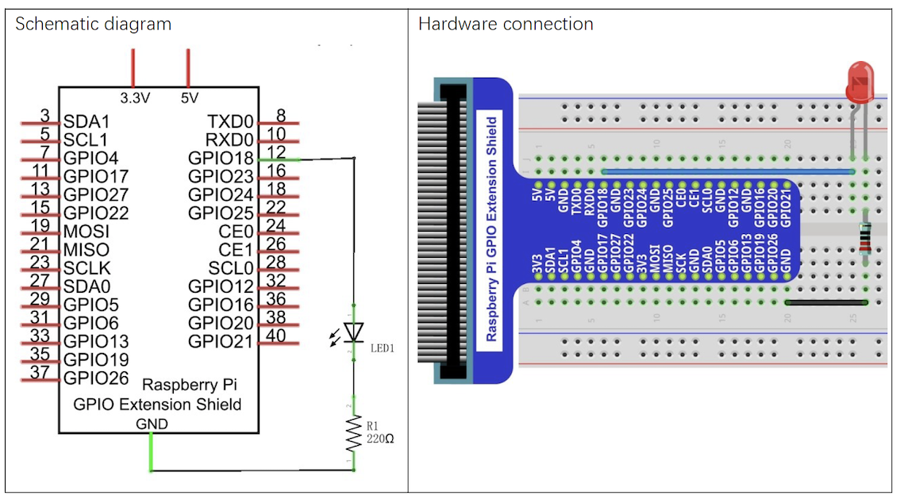
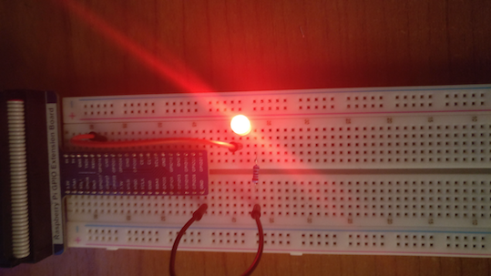

# LED Breathing

## Introduction

This project turns a led on and off progressively.
It simulates an analogic signal by wave modulation.

## Material

* LED Bar
* Resistor 220 &Omega;

## Circuit

## Code

Code is avialabe in Python.

* ``led_breathing.py``

It uses library ``RPi.GPIO``.

GPIO board is used in OUTPUT mode, with PIN 12 - GPIO 18.
The port is set to a frequency of 1 KHz, by using function ``ChangeDutyCycle`` it is possible to control the size of the wave and therefore, simulate an analogic signal.
