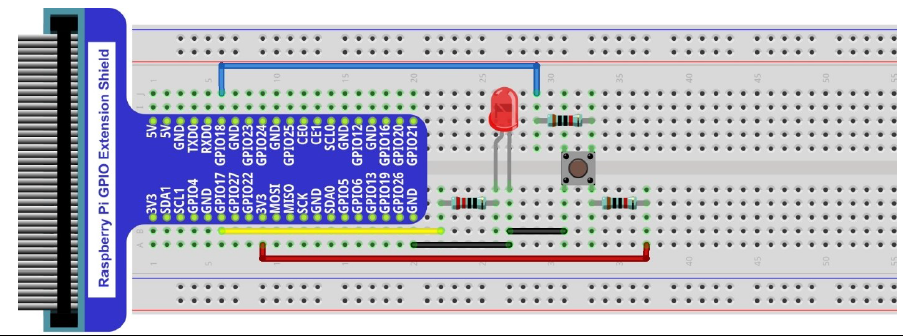
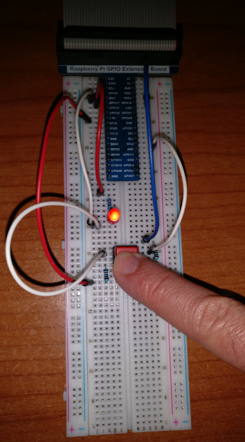

# LED Button

## Introduction

This project turns a led on and off when a button is pressed.
The button is power so that the answer is faster when pressed.

## Material

* LED;
* Resistor 220 &Omega;
* 2 x Resistor 10 k&Omega;
* Push button.

## Circuit

## Code

Code is available in Python.

* ``led_button.py``

It uses library ``RPi.GPIO``.

LED and Push buttons have independent control ports (11 and 12).
