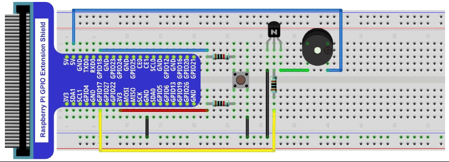
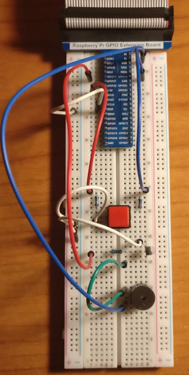

# Buzzer

## Introduction

This project activates a buffer (active and passive) when a button is pressed.

## Material

* NPN Transistor S8050;
* Active and Passive buzzer;
* Resistor 1 k&Omega;
* 2 x Resistor 10 k&Omega;
* Push button.

## Circuit

## Code

Code is available in Python.

* ``buzzer_alarm.py``
* ``buzzer_doorbell.py``

It uses library ``RPi.GPIO``.

The code and circuit is the same for the active or passive buzzer.
The active buzzer has a cover on top.
