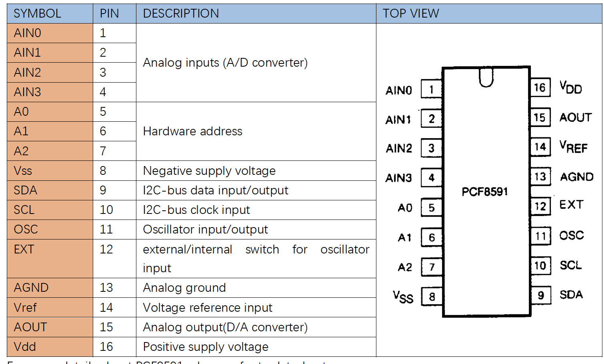
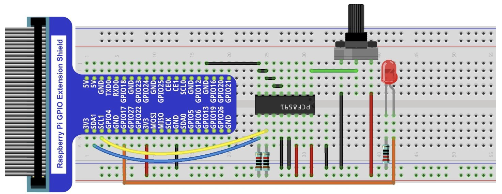
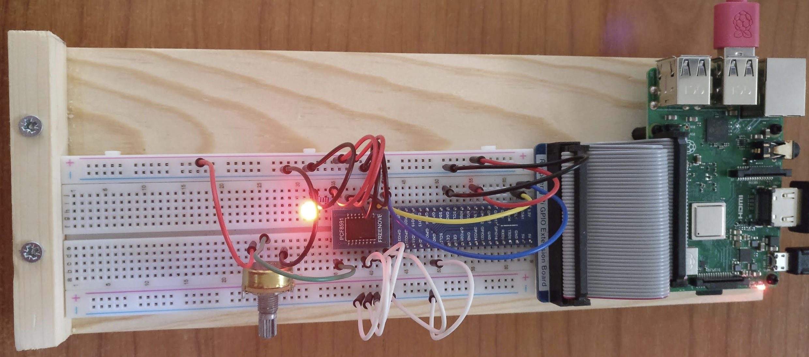

# DA/AD

## Introduction

This project uses a potentiometer to aquire an analogical signal into a digital one.
It then converts the digitial signal back to an analogical to feed a led.
Conversion between analigical and digital is performed by PCF8591, an integrated circuit.

The PCF8591 allows analogic to digital conversion using 8 bits (255 levles). It holds 4 analogical inputs nd 1 digital ouptut. The circuit uses the I2C serial interface for communication.

Data convertion is executed between 3.3V <-> 255 and 0V <-> 0.

## Material

* PCF8591
* Rotary potentiometer
* 2 x Resistor 10 k&Omega;
* 1 x Resistor 220 &Omega;
* Red LED

## Circuit

## Code

Code is available in Python.

* ``AD_DA_Converter.py``

It uses library ``RPi.GPIO``, ``smbus`` and ``time``.
