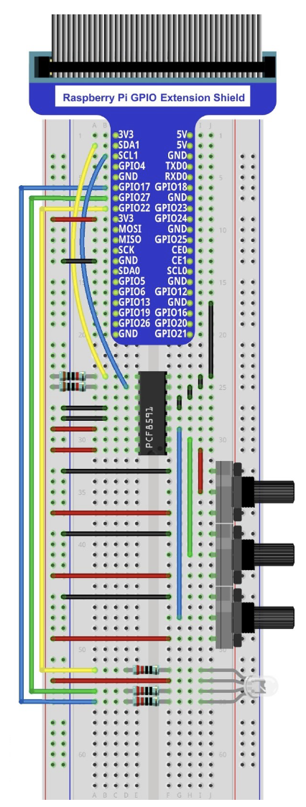

# Buzzer

## Introduction

This project controls a RGB led by using 3 independent potentiometers.
The analog signals from the 3 potentiometers are processed and serve as input for the final colour. Convertion is made in a AD converter.

## Material

* PCF8591;
* 3 xRotary potentiometer;
* 2 x Resistor 10 k&Omega;
* 2 x Resistor 220 &Omega;
* RGB LED.

## Circuit

## Code

Code is available in Python.

* ``potentiometers_rgbp.psy``

It uses library ``RPi.GPIO``, ``smbus`` and ``time``.
